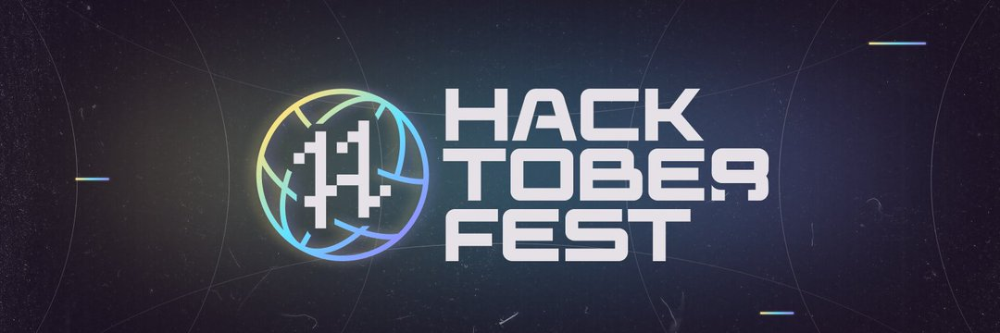

# Hacktoberfest 2022

<div align="center">
  
  </div>
Follow the README below to get started!
# This is a website designed with HTML5 and CSS3 only.

##How you can contribute:

#Code: 

--> GO to ISSUES tab and contribute in any previously created issue or create a new issue.

#Non-code

--> You can work toward making the readme and introduction better in the repository. You can also add more data to the website or correct incorrect data.

#Please star the repository if you think it is beginner friendly.


## Getting Started

* Note : Create issue first or Work on created issue 

1. Fork this repository
2. Run ```git clone <your repo url goes here>```
3. CD into your cloned repo
4. Run ```git checkout -b [your branch name goes here]``` to create your new branch
5. Make your edits and save
6. Run ```git add .```
7. Run ```git commit -m "Commit message goes here"```
8. Finally, run ```git push origin [your branch name goes here]```
9. **Star this repo**
10. Create a new pull request from your forked repository (Click the `New Pull Request` button located at the top of your repo)
11. Wait for your new PR to be reviewed and merged!


After you have contributed, I will add your name in the people who contributed  here.
